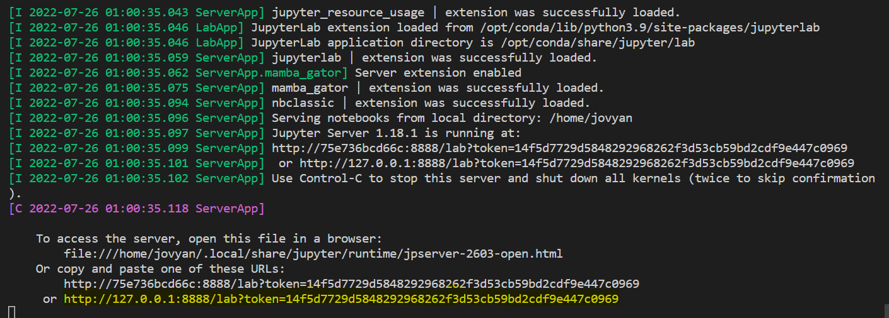
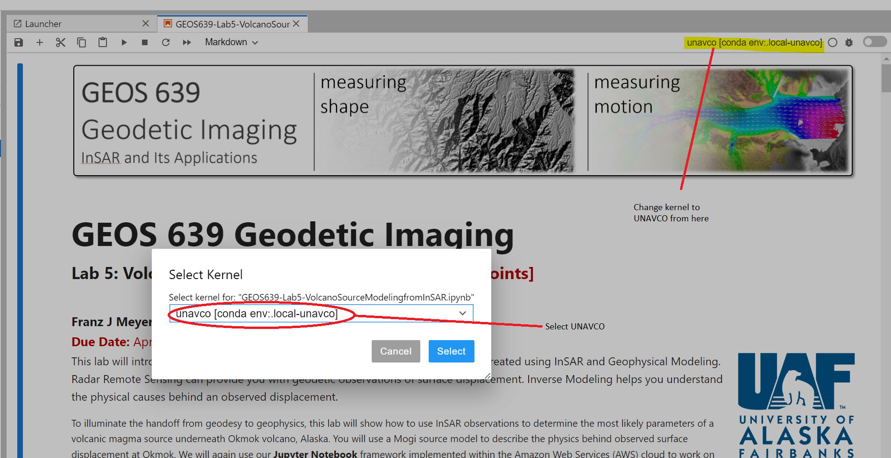

# GEOS639-InSARGeoImaging

## Update March 2024 - The content for the 2024 run of this course is now available on the repo.


## Update: July 25th, 2022 - Dockerfile is set up so that users can run this repo on their environment.

--- 

## **How to use this Repo via Docker**
---

### **1. Install Docker**
Follow instruction on [official documentation](https://docs.docker.com/get-docker/).

*Note: If you are a Windows user, we recommend you to install [WSL2](https://docs.microsoft.com/en-us/windows/wsl/install) as well.*


### **2. Clone this Repo**

First, make sure that you have [git](https://git-scm.com/downloads) installed. 

Then go to [GEOS639 repository](https://github.com/uafgeoteach/GEOS639-InSARGeoImaging/tree/main) and press the green `code` tab. You have two options:

- Install via HTTPS with following command:

`git clone https://github.com/uafgeoteach/GEOS639-InSARGeoImaging.git`

- Install via ssh with following command:

`git clone git@github.com:uafgeoteach/GEOS639-InSARGeoImaging.git`

*Note: You will need to set [ssh key](https://docs.github.com/en/authentication/connecting-to-github-with-ssh/generating-a-new-ssh-key-and-adding-it-to-the-ssh-agent) if you choose to install via ssh.*


### **3. Start GEOS639**
Once you have everything setup, go to this (GEOS639-InSARGeoImaging) repository. Make sure you have `Makefile` on where you're in.

To check this, you can run following commands:
```bash
# Tells where you're at; make sure it ends with GEOS639-InSARGeoImaging
pwd

# Should display 'Makefile' on your terminal
ls | grep Makefile
```

Once you confirm that you have a `Makefile`, run the following command:
```bash
make
```

This may take a while, but you should eventually see a link. If you go to the link displayed, you should be able to open a Jupyter Lab with all the notebooks. See below image for an example.




### **4. Setting Kernel** 

For each notebook, make sure to set the `unavco` kernel before running the notebook. See below image for an example.




### **5. Shutting Off and Restart** 

If you are done, you can terminate the notebook in one of two ways:

1. On your Jupyter Lab, select `File` -> `shut down`.
2. On your terminal, use `ctrl + c` or `command + c`. Then press `y` to confirm shutdown.

If you want to restart the terminal, run `make`, just like you did in step 3.

---

## **Maintenance**

When you are done using this notebook, you may notice that many unnecessary files and directories are created. While you can leave them as is, here's an easy way to clean them up:

### Clean Misc. Items:
Use following command:

```bash
make clean
```

To remove unnecessary items, such as `.jupyter`. This command will not remove files generated from each notebooks.

### Clean Items Generated by Notebooks:

Use following command:

```bash
make course-clean
```
To remove items, such as download images, that was generated from running a notebook. 

**Note: Make sure to preserve items you wish to keep.**


### Removing Docker Images:
If you wish to remove Docker image for GEOS639, run following command:

```docker
docker rmi <name_or_id_of_image>
```

**_Note: Cleaning these items and restarting will cause Docker to build from start, hence `make` commands will take longer to complete compared to restarting without cleaning._**


---
## **Troubleshooting Guide**
---

While running this, you may encounter some issues depending on your OS. Here are some possible solutions to resolve these issues:

---

- `make` doesn't run all the way due to permission error:

Some OS, notably Linux, may cause an issue due to permission errors. If this happens, you will need to provide a proper permission to the entire GEOS639 repository. 

Easiest way to resolve this is by running following command:

```bash
# make sure that you are in the root of GEOS639-InSARGeoImaging
sudo chmod -R 777 .
```

Typically, this will solve the issue in regards to `permission denied` error.

*Note: Since 777 provides access to all users, it may not be appropriate in some scenarios.*

If you are concerned with `777` option, you can also try to run something like this:

```bash
# make sure that you are in the root of GEOS639-InSARGeoImaging
sudo chown -R <username>:<groupname> .
```
where `<username>` and `<groupname>` are dependent on your system.

---
- Lab 1 (located in `Week-02`) takes too long to complete/crashes:

This notebook may not run completely if your computer doesn't have enough resources. Check your CPU and memory usage to see if you are not running too many applications. 

---

- Lab 4 (located in `Week-08`) triggers an error towards the end.

Currently, http://geodesy.unr.edu/ is (25th of July, 2022). We have no control over this as it is hosted by different organization.

---

- Can't restart after shutting down and running `make`. 

It is possible that you didn't shutdown properly and thus container is still running in background. Use following command to check if container is still active:

```docker
# Displays your container if it wasn't shut down properly.
docker ps
```

If above command showed you a container related to GEOS639, terminate the container with one of the following commands:

```docker
# option 1:
docker stop <container_name or container_id>

# option 2:
docker kill <container_name or container_id>

# option 3:
docker container rm -f <container_name or container_id>
```

It should terminate your container and you should be able to run `make` command again.

--- 

- `make` command will fail due to port issue. 

By default, our Dockerfile uses port 8888. If you have another application that is using port 8888, it will not be able to run the container. Try shutting down other applications that are using port 8888.

---

- `make course-clean` gets permission denined error.

Refer to *`make` doesn't run all the way due to permission error:*. If this does not solve the issue, you can still use following command:

```bash
rm -rf <name_of_file_or_directory>
```

to remove junk file one-by-one.

**_Note: We do not recommend removing default contents, such as the `Figs` directory. Use [GEOS639 on GitHub](https://github.com/uafgeoteach/GEOS639-InSARGeoImaging/tree/main) as a reference to determine default contents._**


--- 
If you have any further questions or concerns, please contact us via following email: uaf-jupyterhub-asf+unavco@alaska.edu

